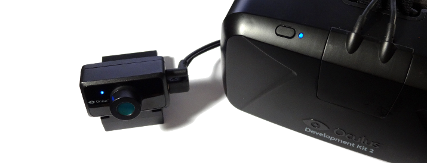

# oculus

Nim bindings for the Oculus VR SDK.




## About

This package contains bindings to the Oculus SDK (libovr) for the
[Nim](http://nim-lang.org) programming language. Oculus provides virtual reality
head-mounted displays and positional tracking devices, such as the DK1, DK2 and
GearVR.


## Supported Platforms

This package is still under heavy development and may not fully work yet. The
following platforms have been built and tested with the **Oculus SDK 0.4.4 Beta**:

- ~~Linux~~
- Mac OSX
- Windows


## Prerequisites

To compile the bindings in this package you must have **libovr**, the Oculus VR
SDK library, installed on your computer. Users of your program need to install
the device drivers, which can be downloaded from the Oculus web site.

### Linux

If your Linux distribution includes a package manager or community repository,
it may already have pre-compiled binaries for both the Daemon and the SDK. For
example, on ArchLinux the driver, udev rules and SDK are available in AUR (see
[ArchWiki](https://wiki.archlinux.org/index.php/Oculus_Rift) for details).

Alternatively, you can download and install the SDK from the Oculus developer
web site.

### Mac OSX

The Mac OSX version of the Oculus SDK currently only includes a static library.
You need to acquire dynamic libraries for *libovr* before you can run programs
compiled with this package.

At this time there are no pre-compiled libraries available online, but you can
clone [jherico's modified Oculus SDK](https://github.com/jherico/OculusSDK)
from GitHub and build them yourself. *cmake* is required to compile *libovr*,
and the easiest way to install it is either via
[MacPorts](http://www.macports.org/):

```port install cmake```

or via [Homebrew](http://brew.sh/):

```brew install cmake```

Then acquire and compile the modified Oculus SDK as follows:

```
git clone --recursive https://github.com/jherico/OculusSDK.git
cd OculusSDK
mkdir .build
cd .build
cmake .. -G Xcode -DCMAKE_BUILD_TYPE=Release  -DBUILD_SHARED_LIBS=ON
xcodebuild -target ovr -configuration Release
```

The *.build/output* directory should now contain a *libovr.dylib* file,
which can be copied into your program's folder.

### Windows

The Windows version of the Oculus SDK currently only includes static libraries
for use in Visual Studio. You need to acquire DLLs for *libovr* before you can
run programs compiled with this package.

The easiest way is to download [JSPenguin's precompiled DLLs]
(https://jspenguin.org/software/ovrsdk/) and rename the files to `libovr.dll`,
`libovrd.dll`, `libovr64.dll` or `libovr64d.dll`, depending on which
configurations you wish to build for (32- or 64-bit, debug or release).

You can also clone [jherico's modified Oculus SDK]
(https://github.com/jherico/OculusSDK) from GitHub and build the DLLs yourself.


## Dependencies

This package does not have any dependencies to other Nim packages at this time.


## Usage

Import the *ovr* module from this package to make the bindings available in your
project:

```nimrod
import ovr
```

## Support

Please [file an issue](https://github.com/nimious/oculus/issues), submit a
[pull request](https://github.com/nimious/oculus/pulls?q=is%3Aopen+is%3Apr)
or email us at info@nimio.us if this package is out of date or contains bugs.
For all other issues related to Oculus devices or the device driver software
visit the Oculus web sites below.


## References

* [Oculus Homepage](https://www.oculus.com)
* [Oculus SDK Download Page](https://developer.oculus.com/downloads/)
* [Oculus SDK 0.4.4 Developer Guide](http://static.oculus.com/sdk-downloads/documents/Oculus_Developer_Guide_0.4.4.pdf)
* [Nim Programming Language](http://nim-lang.org/)
