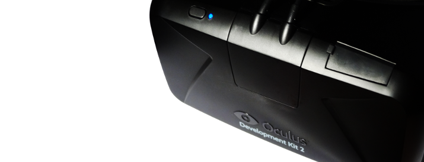

# io-oculus
Nim bindings for the Oculus VR SDK.

## About

io-oculus contains bindings to the Oculus SDK (libovr) for the Nim programming
language. Oculus provides virtual reality head-mounted displays and positional
tracking devices, such as the Rift, DK1, DK2 and GearVR.

## Supported Platforms

io-oculus is still under heavy development and may not fully work yet. So far,
the following platforms have been built and tested:

- ~~Linux~~
- ~~Mac OSX~~
- Windows

## Prerequisites

To compile the bindings in this package you must have **libovr**, the Oculus VR
SDK library, installed on your computer. Users of your program also need to
install the device drivers, which can be downloaded from the Oculus web site.

### Linux

If your Linux distribution includes a package manager or community repository,
it may already have pre-compiled binaries for both the Daemon and the SDK. For
example, on ArchLinux the driver, udev rules and SDK are available in AUR (see
[ArchWiki](https://wiki.archlinux.org/index.php/Oculus_Rift) for details).

Alternatively, you can download and install the SDK from the Oculus developer
web site.

### Mac OSX

TODO

### Windows

The Windows version of the Oculus SDK currently only includes static libraries
for use in Visual Studio. You need to acquire DLLs for libovr before you can
compile io-oculus. The easiest way is to download [JSPenguin's precompiled
DLLs](https://jspenguin.org/software/ovrsdk/) and rename the files to
libovr.dll, libovrd.dll, libovr64.dll or libovr64d.dll depending on which
configurations you wish to build for (32- or 64-bit, debug or release).

Another option is to clone [jherico's modified Oculus SDK]
(https://github.com/jherico/OculusSDK) on GitHub and build the DLLs yourself.

## Dependencies

io-oculus does not have any dependencies to other Nim packages at this time.

## Usage

## Support

Please [file an issue](https://github.com/nimious/io-oculus/issues), submit a
[pull request](https://github.com/nimious/io-oculus/pulls?q=is%3Aopen+is%3Apr)
or email us at info@nimio.us if this package is out of date or contains bugs.
For all other issues related to Oculus devices or the device driver software
visit the Oculus web sites below.

## References

- [Oculus Homepage](https://www.oculus.com)
- [Oculus SDK Download Page](https://developer.oculus.com/downloads/)
